# Keyframe Video Production — an Agent Skill

[简体中文](README.md) · **English** · [繁體中文](README.zh-Hant.md)

> This English edition is authoritative; where the translations differ, it takes precedence.

An [Agent Skill](https://docs.claude.com/en/docs/agents-and-tools/agent-skills) for producing multi-shot AI videos in which every shot starts from a generated keyframe image — from analysing the source work, through storyboard and keyframes, to generated video and a finished, subtitled cut.

The workflow applies to any keyframe-driven video model. It was written and verified against the Agnes video API (`agnes-video-2.5-flash`).

https://github.com/user-attachments/assets/033e52ba-caad-4a17-a287-36918fba43c4

<p align="center"><sub>A 15-second, three-shot sample with spoken Mandarin, made with this workflow. Source file: <a href="examples/tangbao-hatches/tangbao-hatches.mp4">tangbao-hatches.mp4</a></sub></p>

## What it is actually for

Most of the value is not "how to call a video API". It is the discipline around the call:

- **Gates before spend.** Storyboard, blocking, prompts, character cards, keyframes and hosting each stop for approval, so the plan is approved before the money is spent — not a finished clip reviewed after it.
- **Continuity by construction.** Character bibles are assembled into every prompt by script, never hand-copied. Identity comes from cards on a neutral grey background, stress-tested before the film depends on them. Who is in each shot is computed from camera geometry, not remembered.
- **Honest verification.** An agent cannot hear. The skill gathers real evidence that speech exists and never lets it pass for a verdict on language or wording; it checks frames across the whole clip, not one; and it tests any automated detector against known-clean input before believing it.
- **Failure modes that cost real time, written down** — a no-dialogue shot inventing its own stock line, an empty landscape shot filled by a presenter talking to camera, a retry blocked by its own duplicate-submission guard, a verification command's error payload read as "everything was deleted".

## The workflow

```mermaid
flowchart LR
    A["0 · Source analysis"] --> B["1 · Script & storyboard"]
    B --> C["1.5 · Blocking"]
    C --> D["2 · Prompts"]
    D --> E["2.5 · Character cards"]
    E --> F["3 · Keyframes"]
    F --> G["4 · Hosting"]
    G --> H["5 · Video tasks"]
    H --> I["6 · Assembly & checks"]
    I --> J["7 · Record"]
    classDef gate fill:#fff4d6,stroke:#c9a227,color:#222;
    class B,C,D,E,F,G gate;
```



Highlighted stages are **gates**: the agent stops and waits for a human before going on.

| Stage | What goes in | What comes out | The discipline that matters |
|---|---|---|---|
| **0 · Source analysis** (long works) | The source text, as a read-only working copy | Cast roster counted from the text, a character bible by look-stage with chapter citations, an episode map | Measure length and missing chapters first; count the cast instead of recalling it; never commit the source text |
| **1 · Script & storyboard** | A scene or an episode's chapters | Beats, original dialogue, shot table | Borrow structure, not sentences |
| **1.5 · Blocking** | The storyboard | Each scene's actors and cameras on a top-down plan; per-shot cast computed from each camera's field of view | Catches a speaker who is off camera — or a whole sequence of off-screen narration — before any image exists |
| **2 · Prompts** | Asset blocks (style, scene, characters, voices) | One assembled prompt per shot, plus a bilingual review table | Blocks assembled by script; the spoken line in its own paragraph; every negative mirrors a decision this shot actually made; a no-dialogue shot gets its sound written out |
| **2.5 · Character cards** | The bible | Front, back and face cards on neutral grey, then a stress test | Pass mark fixed **before** looking; a failing card is reworked, not the shots |
| **3 · Keyframes** | Prompts + cards | One t = 0 image per shot | Reviewed by the agent first; failures reported as plainly as successes |
| **4 · Hosting** | Approved keyframes | A URL the video API can fetch — or nothing, if the route needs no hosting (see below) | Its own approval; upload directory scanned; every URL re-downloaded and hash-checked; production untouched |
| **5 · Video tasks** | Hosted keyframes + prompts | One clip per shot | Job record written before submitting; every failure classified by its stored state before anything is retried |
| **6 · Assembly & checks** | Clips + script | The finished cut with subtitles | Durations probed, never assumed; loudness per shot type; subtitles drawn by the pipeline, never by the model; frames checked across time; the language verdict left to a human ear |
| **7 · Record** | Everything above | A production log | What is still unverified gets its own section |

The full procedure, verified capability notes, validation checklist, regression tests and failure modes are in [`SKILL.md`](SKILL.md).

## Agents and models

**Any agent.** The skill is plain Markdown plus conventions. Any agent that can read files, run shell commands and make HTTP calls can follow it — [Claude Code](https://code.claude.com/docs/en/overview), [Codex](https://github.com/openai/codex), [Hermes Agent](https://github.com/NousResearch/hermes-agent), or your own.

**Video model — verified with [`agnes-video-2.5-flash`](https://wiki.agnes-ai.com/en/docs/agnes-video-25-flash).** Every rule in this repository was measured on it, in keyframe (first-frame) mode at 720p. Sign up and create an API key at **[platform.agnes-ai.com](https://platform.agnes-ai.com)**. On the [official price page](https://wiki.agnes-ai.com/en/docs/pricing), checked on 2026-09-11, `agnes-video-2.5-flash` is **free for a limited time** (list price $0.025 per second of 720p video); `agnes-video-2.5` without "Flash" is billed. Offers end — check the page before you rely on it.

**Image model — your choice.** Keyframes and character cards have come from an OpenAI image model and from [`agnes-image-2.5-flash`](https://wiki.agnes-ai.com/en/docs/agnes-image-25-flash) (also listed at $0 on the same page). Other keyframe-capable image and video models, MiniMax's among them, fit the same gates; this repository has not tested them, so check their limits yourself.

## Getting the keyframe to the video model

In keyframe mode the video API has to fetch each image, and Agnes accepts only a public URL that stays valid until the task completes. How you meet that decides whether stage 4 exists at all:

| Route | Hosting needed? | Status |
|---|---|---|
| **Agnes image → Agnes video.** `agnes-image-2.5-flash` returns a hosted image URL; pass that same URL to `agnes-video-2.5-flash` | No | ✅ Verified 2026-09-11 |
| **Inline image data.** [MiniMax's video API](https://platform.minimax.io/docs/api-reference/video-generation-i2v) accepts the first frame as a Base64 data URL | No | 📄 Vendor docs only |
| **Temporary static host.** A Firebase Hosting preview channel, or an object-storage bucket with a signed, expiring URL | Yes | ✅ Firebase verified; object storage not tested |
| **Local server + tunnel.** Serve the keyframes from your own machine and expose them with a [Cloudflare quick tunnel](https://developers.cloudflare.com/cloudflare-one/networks/connectors/cloudflare-tunnel/do-more-with-tunnels/trycloudflare/) — no account needed | Yes | ✅ Verified 2026-09-11 |

What the two tests on 2026-09-11 showed:

- **Agnes image → Agnes video worked with no hosting at all.** The image URL carried no expiry parameter and still loaded after the video finished, but how long Agnes keeps it is not documented — download a copy the moment you get it.
- **A local server on its own is not enough.** `localhost` or a LAN address is invisible to the vendor, and most home connections have no public address. The tunnel provides one. Agnes fetched the image once, about 15 seconds after the task was submitted.
- **Test the route from your own network.** The first tunnel attempt looked dead because the local DNS would not resolve the brand-new hostname; resolving it through a public DNS server showed it was fine. For users in mainland China in particular, Firebase and some public DNS servers may be unreachable — the Agnes-only route, or the local-server-plus-tunnel route, avoids the hosting service entirely.

## What some of the stages look like

These come from a 20-shot episode made later with the same workflow.

**Character cards and stress test (stage 2.5).** Two characters share one design, so each is given two independent marks — hair length and the pattern inside the body — and both have to hold in eight poses the film actually needs.


**Blocking plan (stage 1.5).** Green dots are actors, blue wedges are camera fields of view. Each shot cites a camera, and its cast is whoever falls inside that wedge.


**Keyframes (stage 3).** Each image shows the state at t = 0, before the shot's action.


**Checking a no-dialogue shot (stage 6).** Frames taken at the loudest audio moments. With an English prompt the character kept speaking (left); rewritten in Chinese with the sound spelled out and the voice slot set to "no dialogue", the mouth stayed closed throughout (right). A human then confirmed by ear that the shot was silent.

<p>
  
  
</p>

## Example: *Tangbao Hatches* (15 s, three shots, spoken Mandarin)

```
examples/tangbao-hatches/
├── README.md            what the example is and how it was made
├── shots.json           the three shot prompts and lines as submitted
├── keyframes/           shot-01.png … shot-03.png — the approved t = 0 images
└── tangbao-hatches.mp4  the finished 15-second cut (1280×720, H.264 + AAC)
```

| Shot | Length | Picture | Line (Mandarin, original) | Speaker |
|---|---|---|---|---|
| 01 · The shell moves | 5 s | At night on a stone ledge, a girl leans over a glowing egg as it cracks; a young man watches behind her | 「动了……它真的动了！」 *"It moved… it really moved!"* | the girl, breathless |
| 02 · Eyes open | 5 s | A small glowing grub has hatched and opens its eyes; the two people are soft-focus behind it | 「爸爸……妈妈……」 *"Papa… mama…"* | the grub, a small child's voice |
| 03 · Dumbfounded | 5 s | Low angle from behind the grub: the girl stunned, the young man starting to grin | 「我什么时候当妈了？」／「你孵的，可不就是你。」 *"Since when am I a mother?" / "You hatched it — who else?"* | the girl / the young man |

**What this run established.** `agnes-video-2.5-flash` generates intelligible spoken Mandarin with matching lip movement directly from a keyframe and a prompt containing the line — no separate text-to-speech. A human listened and confirmed all three lines were in Mandarin and matched the script; no automated analysis was taken as that verdict.

How it passed through the stages: the scene and its three original lines were approved (1); the image prompts were approved (2); the first keyframes were rejected — the grub's face landed in the uncanny valley and shot 03 repeated shot 01's framing — and were redone with a locked, cute design for the grub and a low, bug's-eye angle for shot 03 (3); the approved keyframes were hosted on a temporary preview channel (4); one `agnes-video-2.5-flash` task per shot, keyframe mode, 720p (5); the clips were normalized and joined (6). The four approval gates themselves were introduced during this run.

This was the **second** run of the workflow. It predates blocking, character cards, the prompt-language rules and the rule that every shot gets subtitles — this cut has none. It is here to show the pipeline end to end and the voice result, not every rule now in `SKILL.md`.

## Repository layout

```
SKILL.md          the skill (authoritative, English)
SKILL.zh.md       an earlier Chinese edition — not yet brought up to date with SKILL.md
README*.md        this page: Simplified Chinese (default), English, Traditional Chinese
examples/         the sample above
docs/images/      the illustrations on this page
LICENSE
```

## Install

Copy the skill into your agent's skills directory, for example:

```sh
mkdir -p ~/.claude/skills/keyframe-video-production
cp SKILL.md ~/.claude/skills/keyframe-video-production/
```

Then ask your agent for a short video from a scene, and it should pick the skill up.

## About the sample media

- Everything in `examples/` and `docs/images/` is AI-generated. Keyframes and cards come from an image model; the keyframe PNGs still carry that generator's C2PA provenance manifest. Motion and audio come from `agnes-video-2.5-flash`.
- The scenes are inspired by the Chinese web novel *Hua Qiangu* (《花千骨》) by Fresh果果. No text from the novel is used; the dialogue, titles and visual designs were written for these runs. The characters belong to their author; the media are shared only to illustrate the workflow, not for commercial use.

## Provenance

Distilled from real production runs between September 8 and 11, 2026: two short technical demos, a 17-shot children's idiom film, and two episodes (18 and 20 shots) adapted from a novel. Each rule in `SKILL.md` records the run that paid for it. Verdicts on spoken language come from a human listening, never from automated analysis.

## License

MIT for the skill and documentation — see [LICENSE](LICENSE). The sample media are provided for illustration; see the note above.
