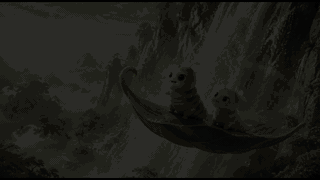

# Keyframe Video Production — an Agent Skill

**English** · [简体中文](README.zh-CN.md) · [繁體中文](README.zh-TW.md)

An [Agent Skill](https://docs.claude.com/en/docs/agents-and-tools/agent-skills) for producing multi-shot AI videos in which every shot starts from a generated keyframe image — from analysing the source work, through storyboard and keyframes, to generated video and a finished, subtitled cut.

The workflow applies to any keyframe-driven video model. It was written and verified against the Agnes video API (`agnes-video-2.5-flash`).

<p align="center">
  <a href="examples/kunlun-one-leaf/kunlun-one-leaf.mp4"></a><br>
  <sub>A 15-second, three-shot sample made with this workflow. Click for the MP4.</sub>
</p>

## What it is actually for

Most of the value is not "how to call a video API". It is the discipline around the call:

- **Gates before spend.** Storyboard, blocking, prompts, character cards, keyframes and hosting each stop for approval, so the plan is approved before the money is spent — not a finished clip reviewed after it.
- **Continuity by construction.** Character bibles are assembled into every prompt by script, never hand-copied. Identity comes from cards on a neutral grey background, stress-tested before the film depends on them. Who is in each shot is computed from camera geometry, not remembered.
- **Honest verification.** An agent cannot hear. The skill gathers real evidence that speech exists and never lets it pass for a verdict on language or wording; it checks frames across the whole clip, not one; and it tests any automated detector against known-clean input before believing it.
- **Failure modes that cost real time, written down** — a no-dialogue shot inventing its own stock line, an empty landscape shot filled by a presenter talking to camera, a retry blocked by its own duplicate-submission guard, a verification command's error payload read as "everything was deleted".

## The workflow

```mermaid
flowchart LR
    A["0 · Source analysis"] --> B["1 · Script & storyboard"]
    B --> C["1.5 · Blocking"]
    C --> D["2 · Prompts"]
    D --> E["2.5 · Character cards"]
    E --> F["3 · Keyframes"]
    F --> G["4 · Hosting"]
    G --> H["5 · Video tasks"]
    H --> I["6 · Assembly & checks"]
    I --> J["7 · Record"]
    classDef gate fill:#fff4d6,stroke:#c9a227,color:#222;
    class B,C,D,E,F,G gate;
```



Highlighted stages are **gates**: the agent stops and waits for a human before going on.

| Stage | What goes in | What comes out | The discipline that matters |
|---|---|---|---|
| **0 · Source analysis** (long works) | The source text, as a read-only working copy | Cast roster counted from the text, a character bible by look-stage with chapter citations, an episode map | Measure length and missing chapters first; count the cast instead of recalling it; never commit the source text |
| **1 · Script & storyboard** | A scene or an episode's chapters | Beats, original dialogue, shot table | Borrow structure, not sentences |
| **1.5 · Blocking** | The storyboard | Each scene's actors and cameras on a top-down plan; per-shot cast computed from each camera's field of view | Catches a speaker who is off camera — or a whole sequence of off-screen narration — before any image exists |
| **2 · Prompts** | Asset blocks (style, scene, characters, voices) | One assembled prompt per shot, plus a bilingual review table | Blocks assembled by script; the spoken line in its own paragraph; every negative mirrors a decision this shot actually made; a no-dialogue shot gets its sound written out |
| **2.5 · Character cards** | The bible | Front, back and face cards on neutral grey, then a stress test | Pass mark fixed **before** looking; a failing card is reworked, not the shots |
| **3 · Keyframes** | Prompts + cards | One t = 0 image per shot | Reviewed by the agent first; failures reported as plainly as successes |
| **4 · Hosting** | Approved keyframes | Temporary public URLs | Its own approval; upload directory scanned; every URL re-downloaded and hash-checked; production untouched |
| **5 · Video tasks** | Hosted keyframes + prompts | One clip per shot | Job record written before submitting; every failure classified by its stored state before anything is retried |
| **6 · Assembly & checks** | Clips + script | The finished cut with subtitles | Durations probed, never assumed; loudness per shot type; subtitles drawn by the pipeline, never by the model; frames checked across time; the language verdict left to a human ear |
| **7 · Record** | Everything above | A production log | What is still unverified gets its own section |

The full procedure, verified capability notes, validation checklist, regression tests and failure modes are in [`SKILL.md`](SKILL.md).

## What some of the stages look like

These come from a 20-shot episode made later with the same workflow.

**Character cards and stress test (stage 2.5).** Two characters share one design, so each is given two independent marks — hair length and the pattern inside the body — and both have to hold in eight poses the film actually needs.


**Blocking plan (stage 1.5).** Green dots are actors, blue wedges are camera fields of view. Each shot cites a camera, and its cast is whoever falls inside that wedge.


**Keyframes (stage 3).** Each image shows the state at t = 0, before the shot's action.


**Checking a no-dialogue shot (stage 6).** Frames taken at the loudest audio moments. With an English prompt the character kept speaking (left); rewritten in Chinese with the sound spelled out and the voice slot set to "no dialogue", the mouth stayed closed throughout (right). A human then confirmed by ear that the shot was silent.

<p>
  
  
</p>

## Example: *One Leaf over Kunlun* (15 s, three shots)

```
examples/kunlun-one-leaf/
├── README.md             what the example is and how it was made
├── shots.json            the three shot prompts as submitted
├── keyframes/            shot-01.png … shot-03.png — the approved t = 0 images
├── kunlun-one-leaf.mp4   the finished 15-second cut (1280×720, H.264 + AAC)
└── preview.gif           small preview for this page
```

| Shot | Length | Picture and motion | Sound |
|---|---|---|---|
| 01 · One leaf rises | 5 s | Two spirit insects ride a green leaf up beside a waterfall; the camera follows and pulls back gently through mist and morning light | Waterfall, breeze; no dialogue |
| 02 · A shadow in the clouds | 5 s | A great bird closes in; the leaf banks left through a gap in the cloud and the insects duck down | Rising wind, a distant cry; no dialogue |
| 03 · First sight of the jade pool | 5 s | The leaf settles by a peach branch, revealing the five-coloured pool and the peach grove as a red bird flies off | Wind drops, birdsong; no dialogue |

How it passed through the stages: a scene was chosen and a three-shot storyboard approved (1); the prompts were written and approved (2); three keyframes were generated and reviewed (3); they were hosted on a temporary preview channel that expired after 24 hours (4); one `agnes-video-2.5-flash` task was submitted per shot in keyframe mode at 720p (5); the clips were normalized and joined (6).

This was the **first** run of the workflow. It predates most of what `SKILL.md` now contains — blocking, character cards, the prompt-language rules, failure classification — which were added as later and larger runs broke in new ways. It is here to show the shape of the pipeline end to end, not every rule in it.

## Repository layout

```
SKILL.md          the skill (authoritative, English)
SKILL.zh.md       an earlier Chinese edition — not yet brought up to date with SKILL.md
README*.md        this page in English, Simplified and Traditional Chinese
examples/         the sample above
docs/images/      the illustrations on this page
LICENSE
```

## Install

Copy the skill into your agent's skills directory, for example:

```sh
mkdir -p ~/.claude/skills/keyframe-video-production
cp SKILL.md ~/.claude/skills/keyframe-video-production/
```

Then ask your agent for a short video from a scene, and it should pick the skill up.

## About the sample media

- Everything in `examples/` and `docs/images/` is AI-generated. Keyframes and cards come from an image model; the keyframe PNGs still carry that generator's C2PA provenance manifest. Motion and audio come from `agnes-video-2.5-flash`.
- The scenes are inspired by the Chinese web novel *Hua Qiangu* (《花千骨》) by Fresh果果. No text from the novel is used; the dialogue, titles and visual designs were written for these runs. The characters belong to their author; the media are shared only to illustrate the workflow, not for commercial use.

## Provenance

Distilled from real production runs between September 8 and 11, 2026: two short technical demos, a 17-shot children's idiom film, and two episodes (18 and 20 shots) adapted from a novel. Each rule in `SKILL.md` records the run that paid for it. Verdicts on spoken language come from a human listening, never from automated analysis.

## License

MIT for the skill and documentation — see [LICENSE](LICENSE). The sample media are provided for illustration; see the note above.
