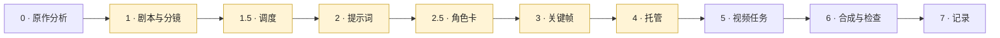

# 关键帧视频制作 — 一个 Agent Skill

[English](README.md) · **简体中文** · [繁體中文](README.zh-TW.md)

一个 [Agent Skill](https://docs.claude.com/en/docs/agents-and-tools/agent-skills)，用于制作多镜头 AI 视频：每个镜头都从一张生成的关键帧图片开始。覆盖从分析原作、分镜、出关键帧，到生成视频、合成带字幕成片的全过程。

适用于任何关键帧驱动的视频模型；基于 Agnes 视频 API（`agnes-video-2.5-flash`）编写并验证。

<p align="center">
  <a href="examples/kunlun-one-leaf/kunlun-one-leaf.mp4"></a><br>
  <sub>用这套流程做的 15 秒三镜头样片，点击查看 MP4。</sub>
</p>

## 它真正解决的问题

价值不在「怎么调一个视频 API」，而在调用周围的纪律：

- **先审批，后花钱。** 分镜、调度、提示词、角色卡、关键帧、托管，每一步都停下来等人批准——批准的是方案，而不是花完钱之后拿到一段不想要的成品再来评价。
- **连续性靠结构保证。** 角色设定由脚本拼进每一条提示词，从不手抄；身份参考用中性灰底的角色卡，并在片子依赖它之前做压力测试；每个镜头里有谁，由摄影机的视野算出来，而不是靠记忆。
- **诚实的验证。** Agent 听不见声音。这个 skill 只拿「确实有人在说话」的客观证据，绝不把它当成「说的语言和台词正确」的结论；检查贯穿整条片段的多个时间点，而不是一两帧；任何自动检测器都要先在已知干净的样本上验证，才能相信它。
- **把真正耗过时间的坑写下来**——没有台词的镜头自己编出一句套话、空镜里冒出对着镜头讲话的主持人、重试被自己的防重复提交机制挡回、验证命令的报错被读成「全部被删了」。

## 工作流程



高亮的是**审批关**：到这里 Agent 会停下来，等人确认再往下走。

| 阶段 | 输入 | 产出 | 关键纪律 |
|---|---|---|---|
| **0 · 原作分析**（长篇作品） | 原作文本（只读工作副本） | 从原文统计出的角色名单、按形象阶段写并标注章节的角色圣经、分集对照表 | 先量篇幅、查缺章；角色靠统计不靠记忆；原文不入库 |
| **1 · 剧本与分镜** | 一场戏或一集对应的章节 | 剧情节拍、原创台词、镜头表 | 借结构，不借句子 |
| **1.5 · 调度** | 分镜 | 每个场景的演员与机位俯视图；由每台摄影机的视野算出的每镜出场名单 | 在出第一张图之前，就能抓出「说话人不在画面里」，甚至整段画外旁白 |
| **2 · 提示词** | 资产块（画风、场景、角色、声音） | 每镜一条拼装好的提示词，外加中英对照审阅表 | 块由脚本拼装；台词单独成段；每条负面约束都对应本镜自己做过的决定；无台词镜头要把声音写出来 |
| **2.5 · 角色卡** | 角色圣经 | 中性灰底的正面、背面、面部特写卡，以及压力测试 | 及格线在看图**之前**定；不及格返工卡，不返工镜头 |
| **3 · 关键帧** | 提示词 + 角色卡 | 每镜一张 t = 0 的图 | Agent 先自己看；问题和优点一样直说 |
| **4 · 托管** | 已批准的关键帧 | 临时公开网址 | 单独审批；上传目录先扫描；每个网址重新下载比对哈希；生产环境不动 |
| **5 · 视频任务** | 已托管的关键帧 + 提示词 | 每镜一段视频 | 提交前先写任务记录；重试前先按记录里的状态给每个失败分类 |
| **6 · 合成与检查** | 视频片段 + 剧本 | 带字幕的成片 | 时长靠实测不靠假设；按镜头类型处理响度；字幕由流程自己叠，不用模型烧的；跨时间点抽帧检查；语言对不对留给人耳判定 |
| **7 · 记录** | 以上全部 | 制作记录 | 还没验证的事项单独列一节 |

完整的操作步骤、已验证的能力说明、校验清单、回归测试与故障模式见 [`SKILL.md`](SKILL.md)（英文，为最新权威版本）。

## 其中几步长什么样

以下图片来自之后用同一套流程做的一集 20 个镜头的片子。

**角色卡与压力测试（第 2.5 步）。** 两个角色用的是同一套造型，所以给每个角色两处互相独立的区分标志——头发长短、身体里的花纹——并且要在片子实际需要的 8 个姿态里都立得住。


**调度俯视图（第 1.5 步）。** 绿点是演员，蓝色扇形是摄影机的视野。每个镜头引用一台摄影机，落在扇形里的人就是这一镜的出场名单。


**关键帧（第 3 步）。** 每张图画的是镜头动作开始之前、t = 0 时的状态。


**检查一个无台词镜头（第 6 步）。** 在音频最响的几个时刻截帧。用英文提示词时角色一直在开口（左）；改用中文、把声音逐项写清楚、人声一项写「无台词」之后，嘴从头到尾都闭着（右）。之后再由人耳确认这一镜确实没有人声。

<p>
  
  
</p>

## 示例：《昆仑一叶》（15 秒，三个镜头）

```
examples/kunlun-one-leaf/
├── README.md             这个示例是什么、怎么做出来的
├── shots.json            实际提交的三条镜头提示词
├── keyframes/            shot-01.png … shot-03.png —— 已批准的 t = 0 关键帧
├── kunlun-one-leaf.mp4   15 秒成片（1280×720，H.264 + AAC）
└── preview.gif           本页用的小预览
```

| 镜头 | 时长 | 画面与运动 | 声音 |
|---|---|---|---|
| 01 · 一叶凌空 | 5 秒 | 两只灵虫乘一片绿叶从瀑布旁升起，镜头跟随并轻轻后拉，穿过水雾和晨光 | 瀑布声、微风；无对白 |
| 02 · 云隙惊影 | 5 秒 | 一只巨鸟逼近，叶子向左侧转、钻过云缝，两只灵虫伏低 | 风声渐强、远处鸟鸣；无对白 |
| 03 · 瑶池初见 | 5 秒 | 叶子停在桃枝旁，五色瑶池与桃林展开，一只红鸟飞远 | 风停、鸟鸣；无对白 |

它走过各个阶段的方式：选定一场戏、批准三镜头分镜（第 1 步）；写好提示词并批准（第 2 步）；生成三张关键帧并检查（第 3 步）；托管到一个 24 小时后自动过期的临时预览频道（第 4 步）；每个镜头提交一个 `agnes-video-2.5-flash` 任务，首帧模式、720p（第 5 步）；片段归一化后拼接（第 6 步）。

这是这套流程**第一次**跑通。`SKILL.md` 里现在的大部分内容——调度、角色卡、提示词语言规则、失败分类——都是后来更大的项目在新的地方出错之后才补上的。放在这里是为了展示整条流水线从头到尾的样子，而不是展示每一条规则。

## 仓库结构

```
SKILL.md          skill 本体（英文，权威版本）
SKILL.zh.md       较早的中文版 —— 尚未与 SKILL.md 同步
README*.md        本页：英文、简体中文、繁体中文
examples/         上面的示例
docs/images/      本页的插图
LICENSE
```

## 安装

把 skill 复制到你的 Agent 的 skills 目录，例如：

```sh
mkdir -p ~/.claude/skills/keyframe-video-production
cp SKILL.md ~/.claude/skills/keyframe-video-production/
```

然后让你的 Agent 根据一场戏做一段短视频，它就会用上这个 skill。

## 关于示例素材

- `examples/` 和 `docs/images/` 里的所有素材都是 AI 生成的。关键帧和角色卡来自图像模型，关键帧 PNG 里仍保留该生成器的 C2PA 溯源信息；运动和声音来自 `agnes-video-2.5-flash`。
- 画面灵感来自 Fresh果果 的网络小说《花千骨》。没有使用小说中的任何文字；台词、标题和视觉设计都是为这些项目原创的。角色版权归原作者所有；这些素材仅用于说明工作流程，不作商业用途。

## 来源

提炼自 2026 年 9 月 8 日至 11 日的真实制作：两个简短的技术演示、一部 17 个镜头的儿童成语片，以及改编自小说的两集（18 个和 20 个镜头）。`SKILL.md` 里的每一条规则都记录了是哪一次制作为它付出了代价。关于说话语言的判定一律来自人耳收听，从不来自自动分析。

## 许可

skill 与文档采用 MIT 许可，见 [LICENSE](LICENSE)。示例素材仅供说明，见上文。
