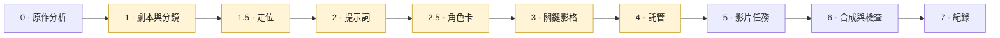
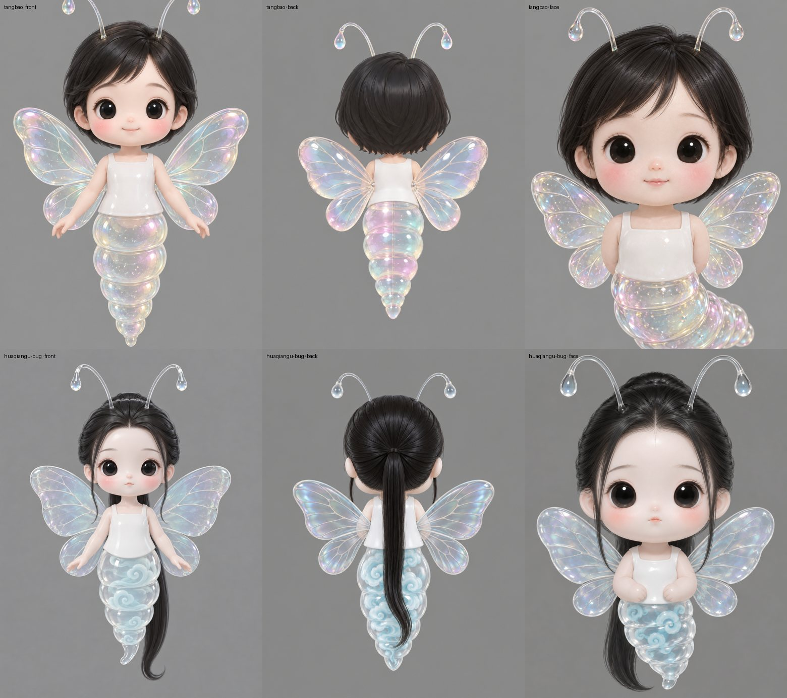
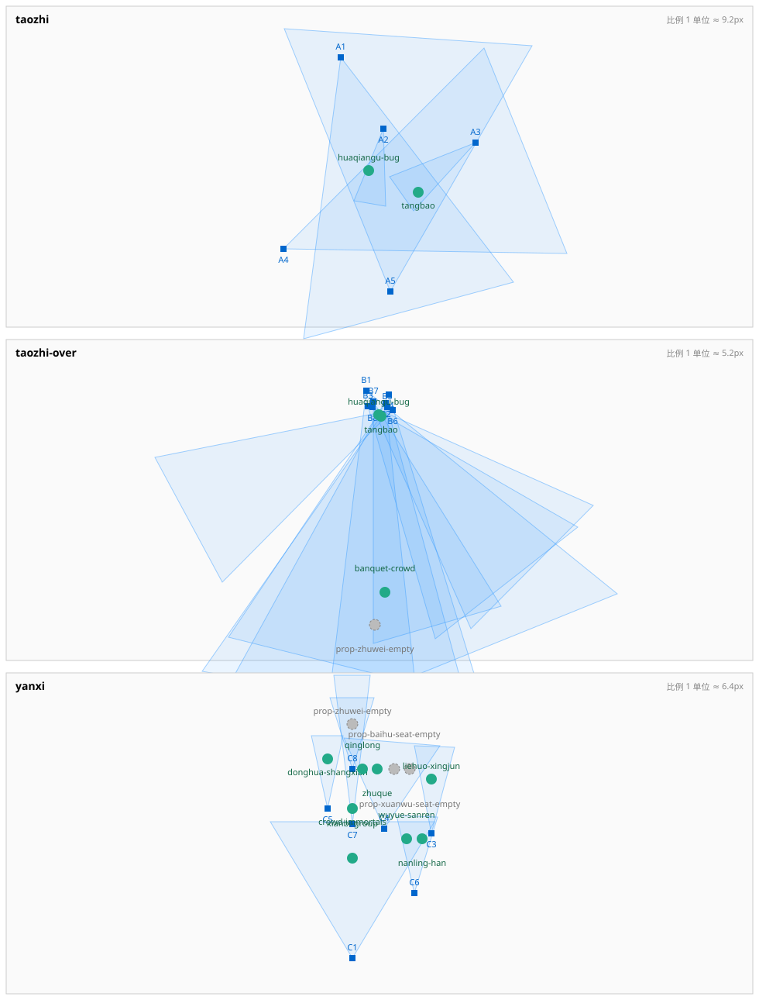

# 關鍵影格影片製作 — 一個 Agent Skill

[简体中文](README.md) · [English](README.en.md) · **繁體中文**

> 各語言版本如有出入，以英文版為準。

一個 [Agent Skill](https://docs.claude.com/en/docs/agents-and-tools/agent-skills)，用來製作多鏡頭 AI 影片：每個鏡頭都從一張生成的關鍵影格圖片開始。涵蓋從分析原作、分鏡、產生關鍵影格，到生成影片、合成附字幕成片的完整流程。

適用於任何以關鍵影格驅動的影片模型；以 Agnes 影片 API（`agnes-video-2.5-flash`）撰寫並驗證。

https://github.com/user-attachments/assets/033e52ba-caad-4a17-a287-36918fba43c4

<p align="center"><sub>用這套流程製作的 15 秒三鏡頭範例，附普通話對白。原始檔案：<a href="examples/tangbao-hatches/tangbao-hatches.mp4">tangbao-hatches.mp4</a></sub></p>

## 它真正要解決的問題

價值不在「怎麼呼叫一個影片 API」，而在呼叫前後的紀律：

- **先核准，再花錢。** 分鏡、走位、提示詞、角色卡、關鍵影格、託管，每一步都停下來等人核准——核准的是方案，而不是花完錢才拿到一段不想要的成品再來評估。
- **連貫性靠結構保證。** 角色設定由程式拼進每一條提示詞，從不手抄；身分參考用中性灰底的角色卡，並在影片依賴它之前做壓力測試；每個鏡頭裡有誰，由攝影機的視野計算出來，而不是靠記憶。
- **誠實的驗證。** Agent 聽不見聲音。這個 skill 只取得「確實有人在說話」的客觀證據，絕不把它當成「語言和台詞正確」的結論；檢查涵蓋整段片段的多個時間點，而不是一兩格畫面；任何自動偵測器都要先在已知乾淨的樣本上驗證過，才能採信。
- **把真正耗過時間的坑寫下來**——沒有台詞的鏡頭自己編出一句套話、空鏡裡冒出對著鏡頭說話的主持人、重試被自己的防重複送出機制擋下、驗證指令的錯誤回傳被讀成「全部被刪了」。

## 工作流程



標示顏色的是**核准關卡**：到這裡 Agent 會停下來，等人確認後才繼續。

| 階段 | 輸入 | 產出 | 關鍵紀律 |
|---|---|---|---|
| **0 · 原作分析**（長篇作品） | 原作文字（唯讀工作副本） | 從原文統計出的角色名單、依造型階段撰寫並標註章節的角色聖經、分集對照表 | 先量篇幅、查缺章；角色靠統計不靠記憶；原文不進版本庫 |
| **1 · 劇本與分鏡** | 一場戲或一集對應的章節 | 劇情節拍、原創台詞、鏡頭表 | 借結構，不借句子 |
| **1.5 · 走位** | 分鏡 | 每個場景的演員與機位俯視圖；由每台攝影機的視野計算出的每鏡登場名單 | 在產生第一張圖之前，就能抓出「說話的人不在畫面裡」，甚至整段畫外旁白 |
| **2 · 提示詞** | 素材區塊（畫風、場景、角色、聲音） | 每鏡一條拼好的提示詞，另附中英對照審閱表 | 區塊由程式拼裝；台詞獨立成段；每條負面限制都對應本鏡自己做過的決定；無台詞鏡頭要把聲音寫出來 |
| **2.5 · 角色卡** | 角色聖經 | 中性灰底的正面、背面、臉部特寫卡，以及壓力測試 | 及格標準在看圖**之前**訂好；不及格就重做角色卡，不重做鏡頭 |
| **3 · 關鍵影格** | 提示詞 + 角色卡 | 每鏡一張 t = 0 的圖 | Agent 先自己檢查；問題和優點一樣直說 |
| **4 · 託管** | 已核准的關鍵影格 | 影片介面取得到的網址——如果做法不需要託管，這一步可以略過（見下文） | 單獨核准；上傳目錄先掃描；每個網址重新下載比對雜湊值；正式環境不動 |
| **5 · 影片任務** | 已託管的關鍵影格 + 提示詞 | 每鏡一段影片 | 送出前先寫任務紀錄；重試前先依紀錄裡的狀態替每個失敗分類 |
| **6 · 合成與檢查** | 影片片段 + 劇本 | 附字幕的成片 | 時長靠實測不靠假設；依鏡頭類型處理音量；字幕由流程自己疊加，不用模型燒錄的；跨時間點抽格檢查；語言對不對交給人耳判定 |
| **7 · 紀錄** | 以上全部 | 製作紀錄 | 尚未驗證的事項單獨列一節 |

完整的操作步驟、已驗證的能力說明、檢核清單、回歸測試與故障模式請見 [`SKILL.md`](SKILL.md)（英文，為最新的權威版本）。

## 適用的 Agent 與模型

**任何 Agent 都能用。** 這個 skill 本身就是 Markdown 文件加一套約定。只要 Agent 能讀檔案、執行命令列、發出 HTTP 請求，就能照著做——[Claude Code](https://code.claude.com/docs/en/overview)、[Codex](https://github.com/openai/codex)、[Hermes Agent](https://github.com/NousResearch/hermes-agent)，或者你自己的 Agent 都可以。

**影片模型：以 [`agnes-video-2.5-flash`](https://wiki.agnes-ai.com/en/docs/agnes-video-25-flash) 驗證。** 本倉庫裡的每一條規則都是在它上面實測出來的，使用首格（keyframe）模式、720p。註冊並建立 API Key：**[platform.agnes-ai.com](https://platform.agnes-ai.com)**。依 2026 年 9 月 11 日查閱的[官方價目頁](https://wiki.agnes-ai.com/en/docs/pricing)，`agnes-video-2.5-flash` **目前限時免費**（原價 720p 影片每秒 $0.025）；不帶「Flash」的 `agnes-video-2.5` 是收費的。優惠會結束，使用前請再查看一次價目頁。

**圖像模型：自由選擇。** 關鍵影格和角色卡用過 OpenAI 的圖像模型，也用過 [`agnes-image-2.5-flash`](https://wiki.agnes-ai.com/en/docs/agnes-image-25-flash)（同一價目頁上也是 $0）。其他支援首格的圖像、影片模型，例如 MiniMax 的，也能套用同樣的核准關卡；本倉庫沒有實測過，各家的限制請自行確認。

## 關鍵影格怎麼交給影片模型

首格模式下，影片介面要自己去取每一張圖。Agnes 只接受公開網址，而且要一直有效到任務完成。如何滿足這一點，決定了第 4 步「託管」要不要做：

| 做法 | 需要託管嗎 | 狀態 |
|---|---|---|
| **Agnes 出圖 → Agnes 影片**：`agnes-image-2.5-flash` 直接回傳一個圖片網址，把這個網址原樣交給 `agnes-video-2.5-flash` | 不需要 | ✅ 2026-09-11 實測通過 |
| **直接傳圖片資料**：[MiniMax 的影片介面](https://platform.minimax.io/docs/api-reference/video-generation-i2v)首格可以直接傳 Base64 資料 | 不需要 | 📄 僅廠商文件 |
| **暫時靜態託管**：Firebase Hosting 預覽頻道，或物件儲存加上有時效的簽名連結 | 需要 | ✅ Firebase 實測；物件儲存未測 |
| **本機伺服器 + 通道**：在自己電腦上放關鍵影格，用 [Cloudflare 臨時通道](https://developers.cloudflare.com/cloudflare-one/networks/connectors/cloudflare-tunnel/do-more-with-tunnels/trycloudflare/)對外公開成網址，不用註冊 | 需要 | ✅ 2026-09-11 實測通過 |

2026 年 9 月 11 日兩次測試的結論：

- **Agnes 出圖 → Agnes 影片，完全不用託管就成功了。** 圖片網址不帶過期參數，影片完成之後仍能開啟；但 Agnes 會保留多久，文件裡沒寫——拿到網址就立刻下載一份存檔。
- **只有本機伺服器不夠。** Agnes 的伺服器看不到你電腦的 `localhost` 或區域網路位址，家用寬頻多半也沒有公開 IP，所以要用通道給它一個公開網址。Agnes 在送出任務約 15 秒後來取了一次圖。
- **先在你自己的網路裡試一次。** 第一次測通道時看起來像是通道壞了，其實是本機 DNS 解析不到這個剛建立的新網域；改用公共 DNS 解析就正常了。不同地區的網路環境差異很大，Firebase 和部分公共 DNS 在某些地方可能連不上——「全用 Agnes」或「本機伺服器 + 通道」這兩種做法都用不到託管服務。

## 其中幾步的實際樣子

以下圖片來自之後用同一套流程製作的一集 20 個鏡頭的影片。

**角色卡與壓力測試（第 2.5 步）。** 兩個角色用的是同一套造型，所以替每個角色設了兩處互相獨立的辨識特徵——頭髮長短、身體裡的花紋——而且要在影片實際需要的 8 個姿勢裡都成立。




**走位俯視圖（第 1.5 步）。** 綠點是演員，藍色扇形是攝影機的視野。每個鏡頭引用一台攝影機，落在扇形裡的人就是這一鏡的登場名單。



**關鍵影格（第 3 步）。** 每張圖畫的是鏡頭動作開始之前、t = 0 時的狀態。


**檢查一個無台詞鏡頭（第 6 步）。** 在音訊最大聲的幾個時刻截圖。用英文提示詞時角色一直在開口（左）；改用中文、把聲音逐項寫清楚、人聲一項寫「無台詞」之後，嘴巴從頭到尾都閉著（右）。之後再由人耳確認這一鏡確實沒有人聲。

<p>
  
  
</p>

## 範例：《糖寶出世》（15 秒，三個鏡頭，中文對白）

```
examples/tangbao-hatches/
├── README.md            這個範例是什麼、怎麼做出來的
├── shots.json           實際送出的三條鏡頭提示詞與台詞
├── keyframes/           shot-01.png … shot-03.png —— 已核准的 t = 0 關鍵影格
└── tangbao-hatches.mp4  15 秒成片（1280×720，H.264 + AAC）
```

| 鏡頭 | 時長 | 畫面 | 台詞（原創） | 說話者 |
|---|---|---|---|---|
| 01 · 破殼 | 5 秒 | 夜裡石台上，少女俯身看著一枚發光、正在裂開的蛋，一位年輕男子在她身後看著 | 「動了……牠真的動了！」 | 少女，屏著氣 |
| 02 · 睜眼 | 5 秒 | 一隻發光的小蟲破殼而出、睜開眼睛，兩個人在牠身後失焦 | 「爸爸……媽媽……」 | 小蟲，童聲 |
| 03 · 傻眼 | 5 秒 | 從小蟲身後的低角度看：少女愣住，年輕男子開始忍不住笑 | 「我什麼時候當媽了？」／「你孵的，可不就是你。」 | 少女／年輕男子 |

（影片中實際說的是普通話；上表台詞以繁體字轉寫。）

**這一輪證實了什麼。** `agnes-video-2.5-flash` 能直接根據一張關鍵影格和一條寫著台詞的提示詞，生成聽得懂的普通話對白，而且口型對得上——不需要另外的文字轉語音。三句台詞是否都是普通話、是否和劇本一致，由人聆聽後確認；沒有拿任何自動分析來代替這個判定。

它經過各個階段的方式：選定這場戲和三句原創台詞並核准（第 1 步）；圖片提示詞核准（第 2 步）；第一版關鍵影格被退回——小蟲的臉有點詭異，而且 03 的構圖跟 01 雷同——重新產生時鎖定可愛的蟲體設定，03 改成低角度的蟲視角（第 3 步）；已核准的關鍵影格託管到暫時預覽頻道（第 4 步）；每個鏡頭送出一個 `agnes-video-2.5-flash` 任務，首格模式、720p（第 5 步）；片段正規化後串接（第 6 步）。四道核准關卡本身就是在這一輪訂下來的。

這是這套流程的**第二**輪。它早於走位、角色卡、提示詞語言規則，以及「每個鏡頭都配字幕」這條規矩——這段成片沒有字幕。放在這裡是為了呈現整條流水線和普通話語音的效果，而不是 `SKILL.md` 裡現在的每一條規則。

## 檔案結構

```
SKILL.md          skill 本體（英文，權威版本）
SKILL.zh.md       較早的中文版 —— 尚未與 SKILL.md 同步
README*.md        本頁：簡體中文（預設）、英文、繁體中文
examples/         上面的範例
docs/images/      本頁的插圖
LICENSE
```

## 安裝

把 skill 複製到你的 Agent 的 skills 目錄，例如：

```sh
mkdir -p ~/.claude/skills/keyframe-video-production
cp SKILL.md ~/.claude/skills/keyframe-video-production/
```

接著請你的 Agent 根據一場戲做一段短片，它就會用上這個 skill。

## 關於範例素材

- `examples/` 和 `docs/images/` 裡的所有素材都由 AI 生成。關鍵影格和角色卡來自影像模型，關鍵影格 PNG 仍保留該生成器的 C2PA 來源資訊；動作與聲音來自 `agnes-video-2.5-flash`。
- 畫面靈感來自 Fresh果果 的網路小說《花千骨》。沒有使用小說中的任何文字；台詞、標題和視覺設計都是為這些專案原創的。角色著作權屬於原作者；這些素材僅用於說明工作流程，不作商業用途。

## 來源

提煉自 2026 年 9 月 8 日至 11 日的實際製作：兩個簡短的技術示範、一部 17 個鏡頭的兒童成語片，以及改編自小說的兩集（18 個與 20 個鏡頭）。`SKILL.md` 裡的每一條規則都記錄了是哪一次製作為它付出了代價。關於說話語言的判定一律來自人耳聆聽，從不來自自動分析。

## 授權

skill 與文件採用 MIT 授權，見 [LICENSE](LICENSE)。範例素材僅供說明，見上文。
